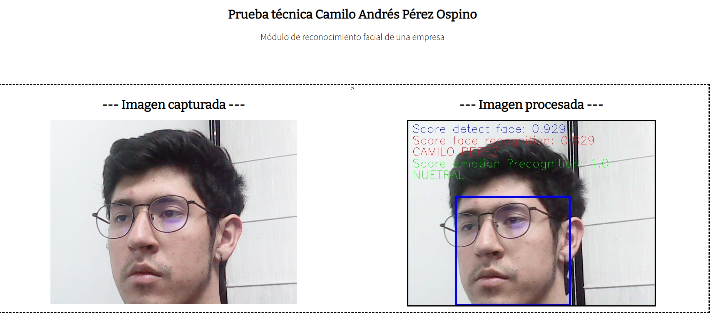

# Prueba Técnica - Ingeniero Junior de ML en Arkangel IA

- Candidato: Camilo Andrés Pérez Ospino
- Telfono: 3238119950
- Correo: camilo.perez.osp@gmail.com

## Situacion presentada: 
*  As a Machine Learning Engineer at Arkangel AI, you receive a project from a biometric data company. This project aims to develop a computer vision model to be able to recognize the workers of a company while detecting the emotion or feeling of each individual. The biometric data company that hires Arkangel AI only imposes two requirements, which are: First, the number of workers will be fixed and to obtain a database, each individual can be asked for several photographs with which to develop the model. And as a second, the developed model must be deployed in the cloud to be able to make inferences to it, from any physical point where the system is deployed. However, this deployment can be done programmatically or through a UI, as Arkangel AI provides.

* As a deliverable, an unlisted (not private) video of the deployed model must be uploaded to YouTube, in which you must show in no more than two minutes how your solution works and a brief explanation of your code in Python. Remember you have 72 hours since the moment you received this email to carry out this project until a first functional prototype with its respective deliverable. After completing the challenge, please reply to this email with the URL of your video.

## Solución propuesta

Para abordar esta situación, la propuesta es realizar una API utilizando FASTAPI contenida en un contenedor Docker para su lanzamiento.

**Pasos para el Despliegue:**

1. Clonar el repositorio:

```bash
git clone https://github.com/CamiloP121/app_facial_recognition.git
```
2. Cambiarse al directorio del Docker:
```bash
cd app_facial_recognition/docker
```
3. Iniciar el script:
```bash
./start.sh
```

** NOTA: ** Los archivos .pkl que son necesarios para ejecutar el algortimo no se lograron subir junto al repositorio, por lo que fueron cargados al siguinete link de drive: [archivos](https://drive.google.com/file/d/1v7yXDPlCHaHuRGAldkPUc2NIdQXp3_8s/view?usp=sharing), se encuentras empaquetados en el un .zip y se deben descromprimir en la raíz del proyecto.

### Resultado


## Detalles técnicos
Para la detección de rostros, se implementó _MediaPipe_ de Google para obtener el rostro.

Solo en caso de que se detecte un rostro, se invoca la clase **face_recognizer** que implementa el modelo _VGG16_ de Keras para el análisis facial. Esta produce una salida en sus 1000 neuronas.

Dicha salida pasa por un módulo de verificación que, mediante la norma de la distancia espacial, verifica a cuál de los grupos preestablecidos es más cercano. Esto es válido tanto para el reconocimiento facial como para el reconocimiento de emociones.

## Bases de datos
Ya que la base de datos era de libre eleccion se tomo:

* Para el reconocimiento facial se utilizó la base [FaceNet | Keras](https://www.kaggle.com/datasets/utkarshsaxenadn/facenet-keras). Esta base, desarrollada por Google en 2015, contiene más de 106 imágenes de 106 celebridades. De estas, se seleccionaron 3 personas (50 imágenes por persona) como objetivo a clasificar. Además, se agregó una cuarta con una base de datos propia para detectarme a mí mismo.


* Para el reconocimiento de emociones, se implementó con la base [Emotion Detection](https://www.kaggle.com/datasets/ananthu017/emotion-detection-fer). Esta es una base de datos que contiene más de 35 imágenes a escala de grises con una resolución de 48x48 píxeles en 7 diferentes tipos de sentimientos: felicidad, neutro, tristeza, enfado, sorpresa, asco y miedo. Se tomaron 60 imágenes por cada categoría.


